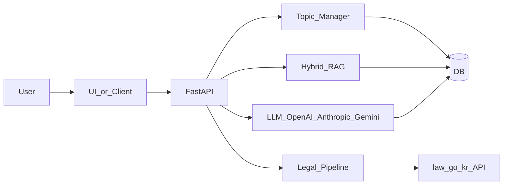

# 행정 AI 업무지원 플랫폼 — 기능 설명 (구현 기준)

본 문서는 저장소의 설계서(PRD/TRD)가 아니라, **`cap` 폴더 아래에 실제로 동작하는 프로그램**을 기준으로 기능을 정리합니다. 구현 본체는 FastAPI 백엔드 [`cap/backend/`](cap/backend/)이며, 법령명·검색 결과 처리 규칙을 TypeScript로 재사용하는 패키지는 [`cap/law-qa/`](cap/law-qa/)입니다.

---

## 1. 한 줄 소개

**연속 대화**를 한 흐름에 저장하고, 메시지마다 **업무 안건(토픽)** 을 자동으로 붙이며, **내부 문서(RAG)** 와 **법령(국가법령정보 Open API, 설정 시)** 을 근거로 답하고, **보고서·공문 등 문서 초안**과 **에이전트 검토·시뮬레이션**까지 이어 줄 수 있는 **지자체 내부직원용 AI 업무지원 MVP**입니다.

---

## 2. 시스템 구성

| 구성요소 | 역할 |
|----------|------|
| **FastAPI 앱** | [`cap/backend/app/main.py`](cap/backend/app/main.py) — API 라우팅, 루트 `/`는 `/ui`로 리다이렉트 |
| **내장 UI** | [`cap/backend/static/`](cap/backend/static/) — `http://127.0.0.1:8000/ui` (접이식 사이드바, 대화·RAG·키 관리 등) |
| **데이터베이스** | 기본 SQLite (`DATABASE_URL` 미설정 시). 멀티유저·배포 시 Postgres(Supabase 연결 문자열) 권장 |
| **인증** | Supabase Auth JWT(`Authorization: Bearer`) 또는 로컬 전용 `ALLOW_DEMO_USER_HEADER=true` + `X-Demo-User` |
| **law-qa (TS)** | 백엔드와 동일한 법령 처리 개념을 프론트/테스트에서 재사용; **실제 HTTP 호출은 백엔드**에서 수행 |

---

## 3. 처리 흐름 (요약 다이어그램)

---

## 4. 사용자 관점 기능

### 4.1 대화 스트림 (Conversation Stream)

- 스트림 생성·목록·조회·삭제, 메시지 목록·전송.
- 인증 API 접두사: `/api/v1/streams/auth` 계열 (소유자만 접근).
- 첫 사용자 메시지 이후 스트림 제목은 토픽·내용 기반으로 자동 보강될 수 있음 (`stream_title`).

### 4.2 자동 토픽(안건) 분류 · 매핑

- 사용자 메시지마다 **토픽 라우팅**(`route_message`): 기존 안건에 붙이거나 새 안건 생성.
- 분류 결과는 DB에 기록(`record_classification`). 응답에 `topic_session_id`, `decision_type`, `detected_topic`, `work_type`, `confidence`, `entities_json` 등이 포함될 수 있음.
- **보조 기능**: 안건 목록, 제목·라벨 수정(`PATCH`), **안건 병합**(`POST .../topics/auth/merge`), **안건 분리**(`POST .../topics/auth/{id}/split`).

### 4.3 질의응답 (채팅 + RAG)

- **Intent 분류** 후 작업 유형에 맞는 태스크로 매핑 (`classify_intent`, `intent_to_task`). 예: `legal_focus`이면 법령 사용 플래그가 강화됨.
- **하이브리드 검색** (`hybrid_search`): BM25(키워드) + 임베딩 코사인 유사도.
- 요청 시 **`document_ids`** 로 검색 대상 문서를 제한할 수 있음(다중 문서 필터).
- 응답에 검색 근거 청크 요약(`sources`), 내부용 메타(`chat_trace.rag` 등)가 포함될 수 있음.

### 4.4 법령

- **`LAW_GO_KR_OC`** 가 설정된 경우: 질의에 맞는 법령 후보 제안 → 본문 조회 파이프라인 → 답변 생성 시 반영. 답변 하단에 **관련 법령 부록** 형태로 붙는 경우가 있으며, `legal_debug`(링크·본문 fetch 요약 등)로 추적 가능.
- OC가 없고 법령 옵션이 켜진 경우: **레거시/스텁 경로**(`fetch_legal`)로 제한적 동작.
- 답변 텍스트 기준 **후처리 보강**(`resolve_laws_for_answer_text`): OC가 있으나 사용자가 법령 토글을 끈 경우에도 답변에 등장한 법령명을 검색해 링크·부록을 붙일 수 있음.
- **법령 조회 통계**: `GET /api/v1/documents/auth/law-popularity` 등.

### 4.5 문서 생성 (토픽 기준)

- `POST /api/v1/topics/auth/{topic_id}/compose` — `kind`: `report`, `memo`, `simulation`, `explanation`, `council` (서버가 허용하는 값).
- **현재 UI 기준**: 같은 엔드포인트에서 **`kind=report`만 허용**하도록 제한되어 있음(다른 종류는 API·다른 경로로 시도 가능 여부는 클라이언트에 따름).
- **일반 생성**: 토픽·스트림 맥락으로 초안 텍스트 생성 (`compose_document`).
- **전체 체인** (`full_chain=true`): 작성 → 상급자 검토 → 법령 체크 등 에이전트 체인 (`run_document_agent_chain`).
- **양식 파일 업로드**: 템플릿에서 본문 추출 후 초안을 양식에 맞게 적응 (`extract_template_plaintext`, `adapt_plain_draft_to_template`).

### 4.6 에이전트 API

- `POST /api/v1/agents/auth/document-chain` — 문서 종류별 체인 (`kind` 동일 집합).
- `POST /api/v1/agents/auth/simulation-chain` — 시뮬레이션 시나리오 + 법령 엮기.

### 4.7 RAG 데이터 인입 · 관리

- 문서 청크 인입: 파일·PDF·URL, **법령 ID 기반 인입** (`law-ingest` 등).
- 문서 목록·메타 수정·삭제, 청크 수 집계.
- **RAG 관리자 이메일**인 경우 전역 공유 문서 플래그 가능 (`is_rag_admin_email`).

### 4.8 스트림 부가 기능

- **역할 토의 (라운드테이블)** `POST .../streams/auth/{stream_id}/roundtable` — `supervisor` / `councilor` / `citizen` 등 역할 조합, 결과를 대화에 저장.
- **검토 패널용 API** (DB에 검토 초안을 바로 넣지 않고 응답만): `review-bootstrap`, `review-reporter-reply`, `review-turn` 등.
- **분할 모드**: `skip_assistant=true`이면 사용자 메시지·토픽만 처리하고 행정 AI 답변·RAG·법령 호출은 생략 (`process_chat_user_only`) — 검토 워크플로 분리용.

### 4.9 사용자 설정 · 보안

- **API 키**: 사용자별 LLM 키 저장 시 **Fernet 암호화** (`FERNET_KEY`).
- **모델 우선순위**: 토픽 override → 작업(task)별 모델 → 사용자 기본 → 시스템 폴백 (`resolve_model`).
- **감사 로그** (`audit_log`): 토픽 병합·분리, 에이전트 체인 시작·완료·실패 등 기록.
- **공개 설정**: `GET` 계열로 Supabase URL 등 프론트에 필요한 비밀이 아닌 설정 노출 (`public_config`).

### 4.10 헬스

- `GET /api/v1/health` — DB·Supabase 설정 여부 등 간단 점검.

---

## 5. 실행 · 접속

1. 터미널에서 **`cap/backend` 디렉터리로 이동**한 뒤 Uvicorn 실행 (저장소 루트에서 `uvicorn app.main:app`만 실행하면 `No module named 'app'` 오류가 날 수 있음).
2. 자세한 명령은 [`cap/backend/README.md`](cap/backend/README.md) 참고 (`--app-dir cap/backend` 또는 `run_backend.py` 등 대안 포함).
3. 기동 후: **API 문서** `http://127.0.0.1:8000/docs`, **채팅 UI** `http://127.0.0.1:8000/ui`.

---

## 6. 환경 변수 요약 (자주 쓰는 항목)

| 변수 | 설명 |
|------|------|
| `DATABASE_URL` | DB 연결 문자열 (기본 SQLite 파일) |
| `FERNET_KEY` | 사용자 API 키 암호화 키 (운영 시 고정 권장) |
| `OPENAI_API_KEY` | 임베딩·답변·분류 등 LLM/임베딩 (없으면 검색·요약 위주·기능 제한) |
| `LAW_GO_KR_OC` | 국가법령정보 Open API OC (있으면 실제 법령 검색·본문 연동) |
| `LAW_GO_KR_*` | 검색 URL, 타임아웃, 본문 API 타깃, 최대 ID 수 등 (README 표 참고) |
| `SUPABASE_URL` / `SUPABASE_ANON_KEY` | 클라이언트 Auth·공개 설정 |
| `SUPABASE_JWT_SECRET` | Bearer **서명 검증** (미설정 시 로컬 편의용 디코딩만 — 운영 위험) |
| `ALLOW_DEMO_USER_HEADER` | `true`면 `X-Demo-User`로 JWT 없이 사용자 구분 (로컬 전용) |
| `SYSTEM_FALLBACK_MODEL` | 시스템 기본 모델 문자열 |

전체 표·설명은 [`cap/backend/README.md`](cap/backend/README.md)를 따릅니다.

---

## 7. 현재 한계 · 주의사항

- **LLM·임베딩 키**가 없으면 답변 품질·기능이 크게 줄거나 일부 API가 빈 응답/502에 가깝게 동작할 수 있음.
- **`LAW_GO_KR_OC` 미설정** 시 법령은 스텁/제한 경로에 머무를 수 있음.
- **`SUPABASE_JWT_SECRET` 미설정** 시 서버 기동 로그에 경고가 출력됨(토큰 서명 미검증).
- **문서 `compose`의 UI 제한**: 인증 `compose`는 코드상 **`report`만** 허용. 다른 문서 종류는 API·에이전트 엔드포인트 등을 통해 별도 호출해야 함.
- **RLS**: Postgres·Supabase 사용 시 SQLAlchemy 연결 역할에 따라 RLS가 우회될 수 있음 — 스키마·운영 가이드 주의.

---

## 8. 관련 문서 (설계·스키마)

- [`cap/PRD.md`](PRD.md), [`cap/TRD.md`](TRD.md), [`cap/AI_SPEC.md`](AI_SPEC.md), [`cap/핵심기능-기술요구사항.md`](핵심기능-기술요구사항.md)
- DB 스키마 예시: [`cap/sql/supabase_schema.sql`](sql/supabase_schema.sql)
