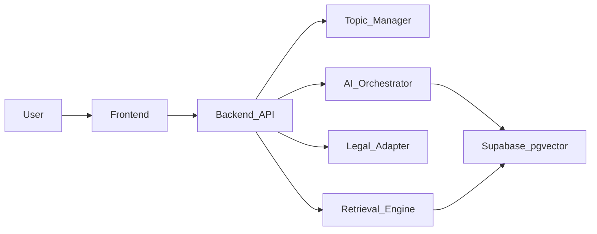

# 핵심 기능·기술 요구사항 요약

**근거 문서**: [PRD.md](PRD.md), [TRD.md](TRD.md), [AI_SPEC.md](AI_SPEC.md) (Version 2.0)

이 문서는 위 설계를 프로그램 구현 관점에서 한곳에 모은 요약입니다.

---

## 1. 제품 한 줄·UX 원칙

**한 줄**: 사용자의 연속 대화를 이해하고, 내부 문서와 현행 법령을 기반으로 업무 주제를 자동 분류하여 질의응답, 보고서·공문 작성, 검토, 시뮬레이션을 지원하는 **주제 인식형 행정 AI 업무지원 플랫폼**.

**UX 원칙**

- 사용자는 세션을 직접 만들거나 고르지 않고 **대화만 이어간다**.
- 시스템이 주제를 자동 분류하고 **업무 단위(Topic Session)** 를 만든다.
- 나중에 **안건별**로 결과를 확인한다.

---

## 2. 핵심 기능

| 구분 | 내용 |
|------|------|
| 연속 대화 (Conversation Stream) | 하나의 채팅 흐름에 모든 메시지 저장 |
| 자동 주제 분류 (Topic Session) | 주제 추출, 기존 주제 연결 또는 신규 생성, 안건 제목 생성 |
| 문서 기반 질의응답 | 다중 문서 선택, 근거 기반 답변, 출처 표시 |
| 법령 실시간 조회 | 법제처 API 연동, 현행 법령·조례 조회, 답변 반영 |
| 문서 생성 | 보고서, 공문 본문, 설명자료, 의회 답변자료 |
| 에이전트 검토 | 상급자 검토, 법령 정합성 검토 |
| 시뮬레이션 | 의회 질의응답, 상급자 리뷰 |
| 사용자 AI 설정 | API Key 등록, 모델 선택, 작업별 모델 설정 |

### 2.1 자동 세션 관리 (시스템 동작)

각 메시지마다: (1) 주제 추출 → (2) 기존 topic과 비교 → (3) 연결 또는 신규 생성.

**사용자 보조**: 안건 목록 보기, 안건 병합·분리, 제목 수정.

### 2.2 사용자 시나리오 (요약)

- 이어서 같은 주제로 질문 → 같은 안건 유지.
- 완전히 다른 주제 → 새 안건 자동 생성.
- 「보고서로 만들어줘」 등 → **현재 안건** 기준 문서 생성.

### 2.3 MVP 범위 (참고)

**포함**: 자동 주제 분류, 문서 기반 Q&A, 법령 조회, 보고서·공문 생성, 사용자 모델 설정.

**제외**: 결재 시스템, SSO, 대시민 서비스.

> **구현 상태 (`cap/backend`)**: MVP를 넘어 핵심 기능 대부분을 반영했습니다. 설명자료·의회 답변자료, 안건 병합/분리, 하이브리드 RAG(키워드+임베딩), 다중 문서 필터, Intent 분류, 에이전트 체인(작성→검토→법령 / 시뮬→법령), OpenAI·Anthropic·Gemini 라우팅, 감사 로그 등.

---

## 3. 시스템·데이터 (기술 요구사항)

### 3.1 주요 구성

- Frontend  
- Backend API  
- AI Orchestrator  
- Retrieval Engine  
- **Topic Manager** (신규)  
- User Model Config  
- Legal API Adapter  
- **Supabase (Postgres + pgvector)**

### 3.2 데이터 모델 (엔티티·테이블)

| 이름 | 용도·주요 필드 |
|------|----------------|
| `conversation_streams` | 전체 대화 흐름: `id`, `user_id`, `title` |
| `topic_sessions` | 업무 단위: `id`, `conversation_stream_id`, `title`, `topic_label`, `work_type` |
| `chat_messages` | 메시지: `id`, `conversation_stream_id`, `content` |
| `message_topic_maps` | 메시지–topic 연결: `message_id`, `topic_session_id` |
| `topic_classifications` | 분류 기록: `message_id`, `detected_topic`, `decision_type` |
| `user_api_keys` | 사용자 API 키 (암호화 저장) |
| `user_model_preferences` | 모델 선호·설정 |

### 3.3 Topic Manager

**역할**: 주제 분류, topic 매칭, topic 생성·연결.

**흐름**: 메시지 입력 → Topic Classifier 실행 → 기존 topic 비교 → routing 결정.

### 3.4 검색·법령

- **검색**: Vector + Keyword 하이브리드, topic 기반 context aggregation.  
- **법령**: API 호출, snapshot 저장, topic session과 연결.

### 3.5 사용자 AI 설정 적용

모델 선택, API Key 적용, **topic별 override** 가능.

### 3.6 AI 실행 흐름 (백엔드 관점)

1. 메시지 입력  
2. Topic 분류  
3. Retrieval  
4. 법령 조회 (선택)  
5. 모델 선택  
6. 답변 생성  

### 3.7 보안·확장

- **보안**: API Key 암호화 저장, 문서 접근 권한 필터링, 로그 기록.  
- **확장**: 멀티 기관, 대시민 확장 가능, 모델 provider 교체 가능.

### 3.8 구성 참고 (개발 관점)

---

## 4. AI·오케스트레이션 (기술 요구사항)

### 4.1 목표

근거 기반 응답, 법령 기반 정확성, 주제 자동 분류, 문서 생성 자동화.

**구조**: RAG + **Topic Classification** + **Agent Chain**.

### 4.2 AI 구성 요소 (압순)

1. Intent Classifier  
2. Topic Classifier  
3. Topic Matcher  
4. Topic Router  
5. Retrieval Orchestrator  
6. Legal Adapter  
7. Model Resolver  
8. Answer Generator  
9. Document Composer  
10. Reviewer Agent  
11. Legal Checker  
12. Simulation Agent  

### 4.3 Topic Classification

**입력**: 현재 메시지, 최근 대화.  
**출력**: `topic_label`, `work_type`, `entities`, `confidence`.

### 4.4 Topic Routing 결정 유형

- `matched`  
- `new_topic`  
- `ambiguous`  

### 4.5 모델 선택 우선순위

1. topic override  
2. task model  
3. user default  
4. system fallback  

### 4.6 답변 정책

법령 우선, 내부 문서 보조, 출처 구분, 추정 최소화.

### 4.7 문서 생성 정책

템플릿 기반, 세션 요약 기반, 행정 문체 유지.

### 4.8 에이전트 체인

- **문서 생성**: writer → reviewer → legal_checker  
- **시뮬레이션**: writer → simulation → legal_checker  

### 4.9 실패 처리

근거 부족 시 명시, 법령 실패 시 경고, 모델 실패 시 fallback.

### 4.10 품질 기준 (요약)

- **좋은 답변**: 근거 있음, 법령 정확, 실무 사용 가능.  
- **나쁜 답변**: 환각, 법령 오류, 근거 없음.

### 4.11 차별점 (AI 관점)

Topic-aware, Legal-aware, Document-aware AI.

---

## 5. 구현 시 체크리스트 (빠른 검증용)

- [x] DB 스키마: streams, topics, messages, maps, classifications(+entities), kb_documents, kb_chunks(+embedding_json, document_id), user keys/preferences, audit_logs — [supabase_schema.sql](sql/supabase_schema.sql), SQLite 마이그레이션 [migrate_sqlite.py](backend/app/db/migrate_sqlite.py)  
- [x] 임베딩·하이브리드 검색: BM25 + 쿼리/청크 임베딩 코사인 결합 — [retrieval.py](backend/app/services/retrieval.py)  
- [x] Topic Manager + Intent — [topic_manager.py](backend/app/services/topic_manager.py), [intent_classifier.py](backend/app/services/intent_classifier.py)  
- [x] Legal Adapter 스냅샷·토픽 연결 — 기존 + Intent 시 자동 법령 플래그  
- [x] Model Resolver + 멀티 프로바이더 LLM — [llm_client.py](backend/app/services/llm_client.py)  
- [x] API Key 암호화, 사용자별 RAG 스코프(`user_id`), 감사 로그 — [audit_log.py](backend/app/services/audit_log.py), `GET /users/me/audit-logs`  
- [x] 에이전트 체인 — [agent_chains.py](backend/app/services/agent_chains.py), `POST /agents/auth/document-chain`, `simulation-chain`, `compose?full_chain=true`  
- [x] 안건 병합·분리 API — `POST /topics/auth/merge`, `POST /topics/auth/{id}/split`  
- [ ] pgvector 전용 인덱스(대규모): 현재는 `embedding_json` + 앱 내 코사인; Supabase pgvector 컬럼은 스키마 주석 참고  
- [ ] 결재·SSO·대시민: PRD 제외 범위  

---

*원문 상세는 PRD / TRD / AI_SPEC을 따릅니다.*
